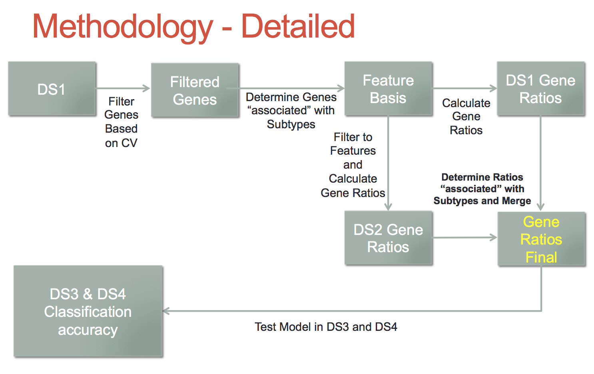
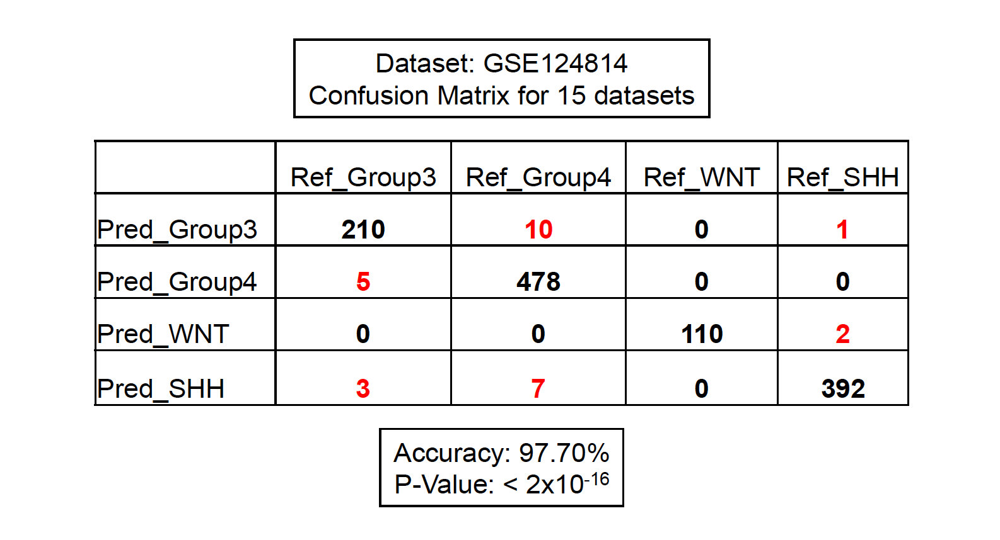
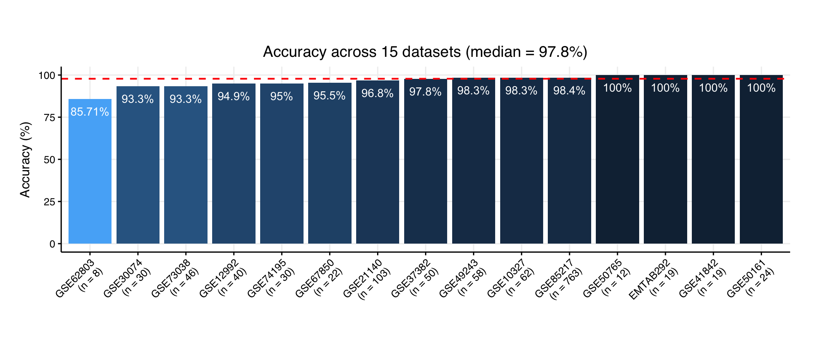

# MedulloClassifier

## Objective

The goal of this project is to develop a model/function that can accurately predict amongst 4 molecular subtypes of Medulloblastoma, Sonic Hedgehog (SHH), WNT, Group 3, and Group 4 from RNA-Seq or microarray data (and potentially any transcriptomic data). These subtypes were first identified using Non-negative matrix factorization on microarray data (https://www.ncbi.nlm.nih.gov/pmc/articles/PMC4874239/). Since then, these subtypes are widely used in both research and clinical practice (https://www.ncbi.nlm.nih.gov/pmc/articles/PMC4105823/). It is important to note there are other studies that classify medulloblastoma's into many more subgroups (https://www.ncbi.nlm.nih.gov/pmc/articles/PMC6163053/). This classifier is not capable of that currently as we don't have adequate training data. 

## Method

The classifier was built using multiple microarray and RNA-Seq datasets. As there is tremendous variability in the dynamic range and values of microarray (between different platforms) and RNA-Seq, gene ratio's instead of gene expression were used as features for the model. Discrimanating features (gene ratios) were identified using the limma package (https://academic.oup.com/nar/article/43/7/e47/2414268) and samples are classified using an un-weighted sum of normalized scores. The data was trained using 2 datasets and tested in 15 separate datasets. 

## Code 

	├── 01_BuildClassifierRNASeq.R # Build classifier using RNA-seq
	├── 02_BuildClassifierMicroarray.R # Build classifier using Microarray
	├── 03_BuildClassifierMaster.R # Test classifier on small datasets
	├── 04_classifyGSE85217.R # Test classifier on GSE124814 (n = 1286; 15 datasets)
	├── 05_summarystats_GSE124814.R # Generate summary statistics and visuals for GSE124814

## Results

The results reflect testing among 15 separate datasets from the GEO dataset GSE124814 although more independent datasets are needed and further refinement of the model is necessary. The overall trend is that the model/function can discern WNT and SHH very well but has a tougher time with Group 3 and Group 4 which may be expected as Group 3 and Group 4 are not characterized as well. The classifier is still being refined but can currently differentiate between the 4 subtypes with a median accuracy of 97.80%.

### Confusion matrix across 15 datasets

### Accuracy across 15 datasets

