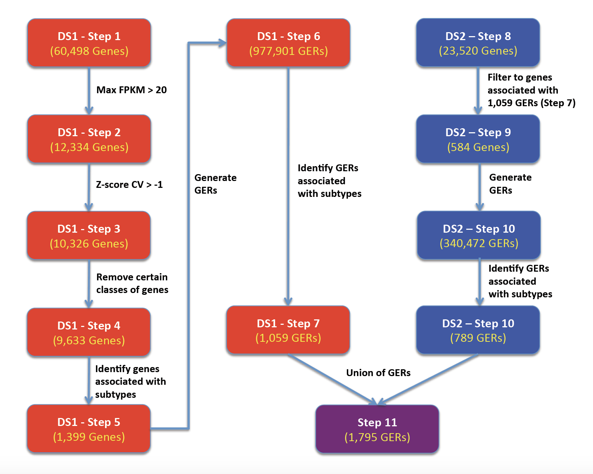

# MedulloClassifier

## Objective

The goal of this project is to develop a model/function that can accurately predict amongst 4 molecular subtypes of Medulloblastoma, Sonic Hedgehog (SHH), WNT, Group 3, and Group 4 from RNA-Seq or microarray data (and potentially any transcriptomic data). These subtypes were first identified using Non-negative matrix factorization on microarray data (https://www.ncbi.nlm.nih.gov/pmc/articles/PMC4874239/). Since then, these subtypes are widely used in both research and clinical practice (https://www.ncbi.nlm.nih.gov/pmc/articles/PMC4105823/). It is important to note there are other studies that classify medulloblastoma's into many more subgroups (https://www.ncbi.nlm.nih.gov/pmc/articles/PMC6163053/). This classifier is not capable of that currently as we don't have adequate training data. 

## Method

The classifier was built using multiple microarray and RNA-Seq datasets. As there is tremendous variability in the dynamic range and values of microarray (between different platforms) and RNA-Seq, gene ratio's instead of gene expression were used as features for the model. Discrimanating features (gene ratios) were identified using the limma package (https://academic.oup.com/nar/article/43/7/e47/2414268) and samples are classified using an un-weighted sum of normalized scores. The data was trained using 2 datasets and tested in 15 separate datasets. 



## Results

The results reflect testing among 15 separate datasets from the GEO dataset GSE124814 although more independent datasets are needed and further refinement of the model is necessary. The overall trend is that the model/function can discern WNT and SHH very well but has a tougher time with Group 3 and Group 4 which may be expected as Group 3 and Group 4 are not characterized as well. The classifier is still being refined but can currently differentiate between the 4 subtypes with a median accuracy of 97.80%.

### Confusion matrix across 15 datasets


### Accuracy across 15 datasets


## Steps to Install Package
To install the package inside RStudion console:
```
devtools::install_github("d3b-center/medullo-classifier-package")
```
\
To install the package from terminal, first clone the repository:
```
# HTTPS
git clone https://github.com/d3b-center/medullo-classifier-package.git

# SSH
git clone git@github.com:d3b-center/medullo-classifier-package.git
```
\
Next, use following command inside terminal:
```
R CMD INSTALL --no-multiarch --with-keep.source medullo-classifier-package
```

## Run
In order to run the package, you need two types of input:

	1. Expression Matrix
		* A dataframe of NxM dimension containing expression values. 
		* Rownames are HUGO/HGNC gene symbols and column names are Sample identifiers. 
		* The following types of expression data are allowed as inputs: (1) FPKM (2) TPM (3) quantile normalized data (4) microarray data.

	2. Subtype information
		* A vector of length M containing Medulloblastoma subtypes corresponding to each sample identifier. 
		* Allowed values are **Group3, Group4, SHH, WNT and U (for Unknown)**

*NOTE:* At least two samples are required for classification, as there is a step that includes calculating correlations. 

There are two functions to run:

	1. classify samples into medulloblastoma subtypes 
	predicted_classes <- classify(exprs = expression_matrix) 

	2. compute stats on accuracy
	accuracy <- calcStats(observed_classes, predicted_classes$best.fit)
	
## Example

This is an example run with the GEO dataset GSE109401:

```
> library(medulloPackage)

# Load formatted expression matrix and vector containing observed classifications
> data(exprs_109401)
> data(actual_109401)


# View contents of data
> head(actual_109401)
[1] "Group3" "Group3" "Group3" "Group3" "Group3" "Group4"


> head(exprs_109401)[1:5]
        GSM2942323 GSM2942324 GSM2942325 GSM2942326 GSM2942327
MAB21L2  10.628020   5.041162   6.989021  13.029481   8.079675
NNAT      8.699344  12.091451   9.750708  11.094928  11.048316
ARL6IP1  11.274906  12.682856  12.359164  11.541582  10.410685
TTR      10.133714  11.638654  10.569395   6.961227  11.720996
CTTNBP2   7.720421   4.493830   5.548766   9.383114   7.196604
VMP1     10.329404  10.525463  10.342894  10.333212  10.787795


# Run classifier
> pred_109401 <- medulloPackage::classify(exprs_109401)


# View output of classifier
# predicted classes
> head(pred_109401$best.fit)
[1] "Group3" "Group3" "Group3" "Group4" "Group3" "Group4"


# associated pvalues
> head(pred_109401$p.value)
[1] 2.223789e-11 3.590628e-07 1.421319e-08 7.532876e-01 1.834332e-07 6.717847e-02


# Calculate statistics
> stats <- medulloPackage::calcStats(actual_109401, pred_109401)
[1] "Accuracy: 95%"


> confusion.matrix <- stats[[1]]
> overall.stats <- stats[[2]]
> class.stats <- stats[[3]]
> accuracy <- stats[[4]]


# View stats
> head(confusion.matrix)
            Ref_Group3 Ref_Group4 Ref_WNT Ref_SHH
Pred_Group3          4          0       0       0
Pred_Group4          1          4       0       0
Pred_WNT             0          0       5       0
Pred_SHH             0          0       0       5


> head(overall.stats)
                  stats
Accuracy          94.7%
Kappa             93%  
AccuracyLower     74%  
AccuracyUpper     99.9%
AccuracyNull      26.3%
AccuracyPValue 5.23e-10


> head(class.stats)
              Sensitivity Specificity Pos Pred Value Neg Pred Value Precision Recall    F1 Prevalence
Class: Group3         80%        100%           100%          93.3%      100%    80% 88.9%      26.3%
Class: Group4        100%       93.3%            80%           100%       80%   100% 88.9%      21.1%
Class: WNT           100%        100%           100%           100%      100%   100%  100%      26.3%
Class: SHH           100%        100%           100%           100%      100%   100%  100%      26.3%
              Detection Rate Detection Prevalence Balanced Accuracy
Class: Group3          21.1%                21.1%               90%
Class: Group4          21.1%                26.3%             96.7%
Class: WNT             26.3%                26.3%              100%
Class: SHH             26.3%                26.3%              100%


> head(accuracy)
[1] "Accuracy: 95%"

```

